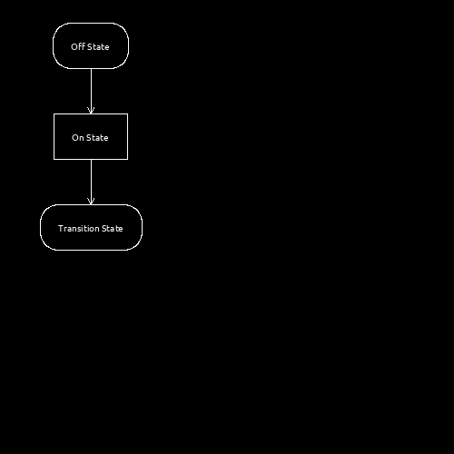

# Diagrams [](https://travis-ci.com/bewakes/diagrams) [](https://codecov.io/gh/bewakes/diagrams)

Draw state and flowchart diagrams from text

## Example
Note that # denotes comment line
```
# DEFINITIONS
a := "Off State"                   # Variable 'a' definition
b := "On State"                    # Variable 'b' definition
c := "Transition State"            # Variable 'c' definition


# Rules

(a) -> [b] -> (c)

#/"curr state"/ -> /"man"/
#
#
## Vertical layout
#(a) -> (b) <- [c]
#["another state"] -> ("bibek")``
```
resulsts in the following diagram: 



